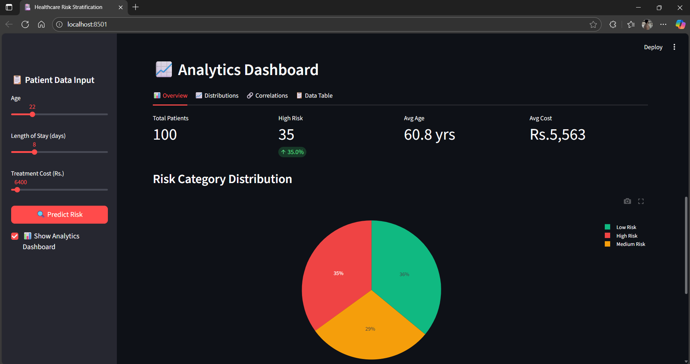
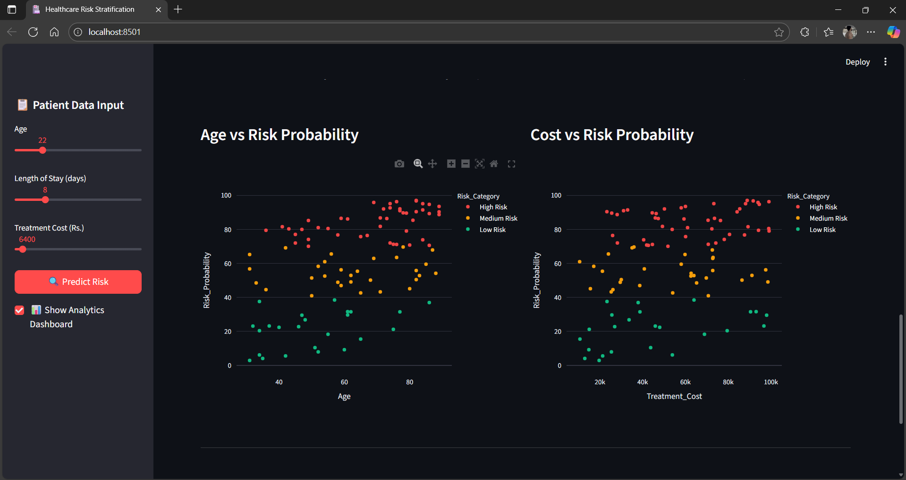
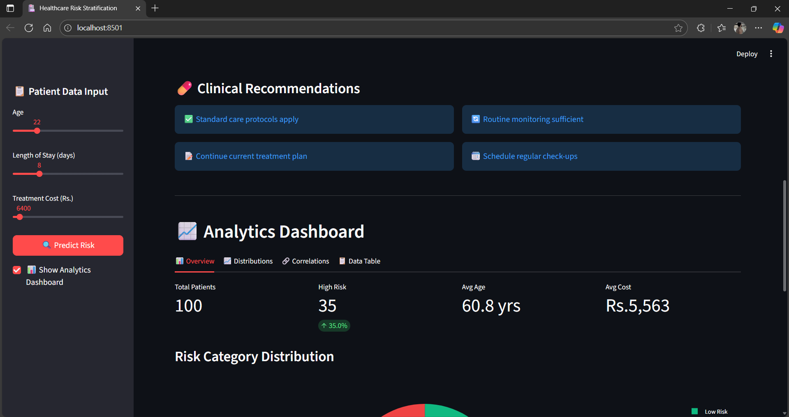
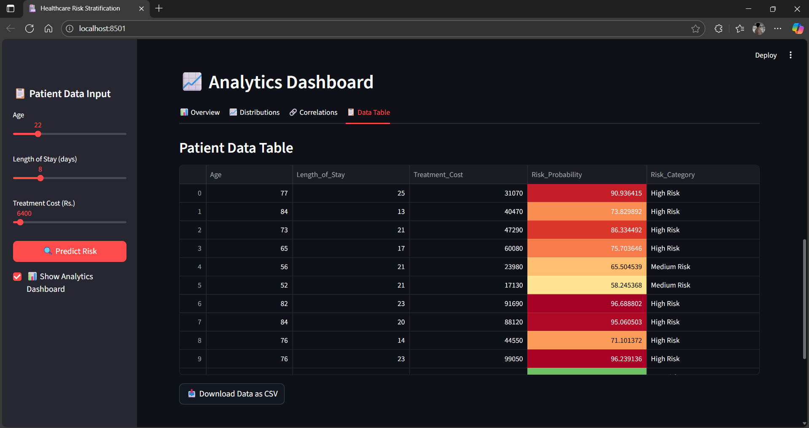
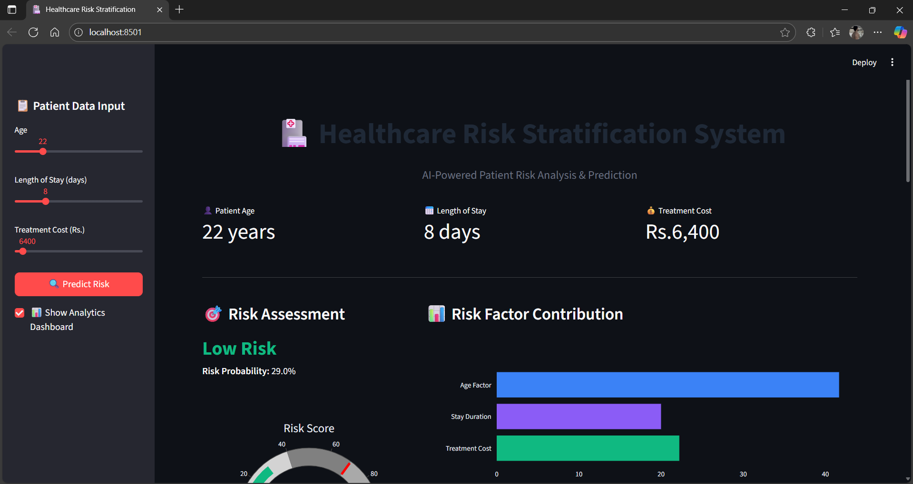
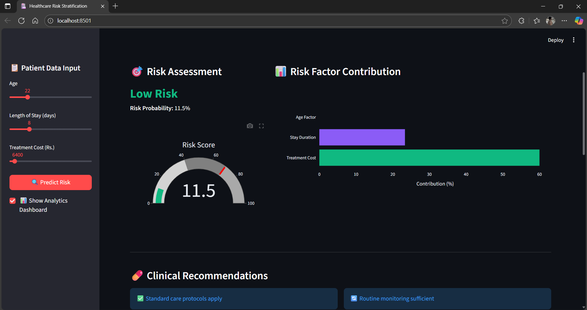

🏥 Healthcare Risk Stratification

A data-driven Streamlit web application for health risk stratification, built using Python, Pandas, Plotly, and Streamlit.This app visualizes patient data, predicts risk probabilities, and helps healthcare professionals make informed decisions.

⸻


1️⃣ Features :

-📊 Interactive Dashboards – Visualize treatment cost distributions, risk probabilities, and correlations.

-🔍 Data Analysis – Analyze patient data for key health insights.

-🧮 Risk Prediction – Classify patients into Low, Medium, or High Risk categories.

-⚙️ Dynamic Filtering – Filter and explore patient information in real time.

-🧠 Machine Learning Ready – Easily extend the project to include ML-based predictions.

⸻


2️⃣ Getting Started :

Follow these steps to set up and run the project locally 👇

 1️. Clone the Repository :

    ```bash
        git clone https://github.com/AadilS728/healthcare-risk-app.git
        cd healthcare-risk-app

 2️. Create a Virtual Environment (Recommended) :

       python -m venv venv

 3️. Activate the Virtual Environment : 
 
   🪟 On Windows:
   
       venv\Scripts\activate

   🍎 On Mac/Linux:
   
        source venv/bin/activate
        
  4️. Install Dependencies :
  
    pip install -r requirements.txt      
    
 5️. Run the Application :
 
     streamlit run Healthcare_Risk.py

 After running this command, Streamlit will open your app automatically in a browser window.
 If it doesn’t, visit:

     http://localhost:8501    

     

⸻

3️⃣ Screenshots : 

1. Dashboard Overview :
 

2. Treatment Cost Distribution :


3. Clinical Recomendation :


4. Data Table :


5. Homepage Overview :



6. Risk Assessment :



⸻

4️⃣ Tech Stack :

Category :

    1️. Frontend
    2. Backend / Logic
    3. Data ProcessingPandas, NumPy
    4. Visualization
    5. Development Tools VS Code, Git, GitHub

Technologies : 

    1. Streamlit
    2. Python
    3. Plotly Express
    4. Matplotlib

⸻

📁 Project Structure

Healthcare Risk Stratification App Project/

├── Healthcare_Risk.py 
# Main Streamlit application

├── Healthcare_risk_data.csv 
# Patient dataset

├── requirements.txt
 # Dependencies

├── README.md
 # Project documentation

├── images/
 # Folder for screenshots

   Analytics_dashboard.png
   Correlation_heatmap.png
   Clinical_Recomendations.png
   Data_Table.png
   Homepage_overview.png
   Risk_Assessment.png


├── .gitignore
 # Ignoregit


⸻

📦 requirements.txt :
 
    1. pandas
    2. streamlit
    3. plotly
    4. numpy
    5. matplotlib

⸻

📊 Example Output
1. Interactive dashboard showing treatment cost vs. risk probability.
2. Correlation heatmap for analyzing relationships between factors.
3. Data table with color-coded risk categories.
⸻

🧑‍💻 Author :

Aadil S.

📧 [shiakhaadilshafiullah5558@example.com]

🔗 LinkedIn Profile : http://www.linkedin.com/in/shaikh-aadil

💻 GitHub : https://github.com/AadilS728/healthcare-risk-app.git

⸻

🪪 License :

This project is licensed under the MIT License – you’re free to use and modify it with proper credit.

⸻

🌟 Acknowledgements: 

Streamlit
Plotly
Pandas
An open-source healthcare datasets for testing and visualization.

If you found this project useful, please ⭐ star this repo on GitHub and share your feedback!

Thank You!
